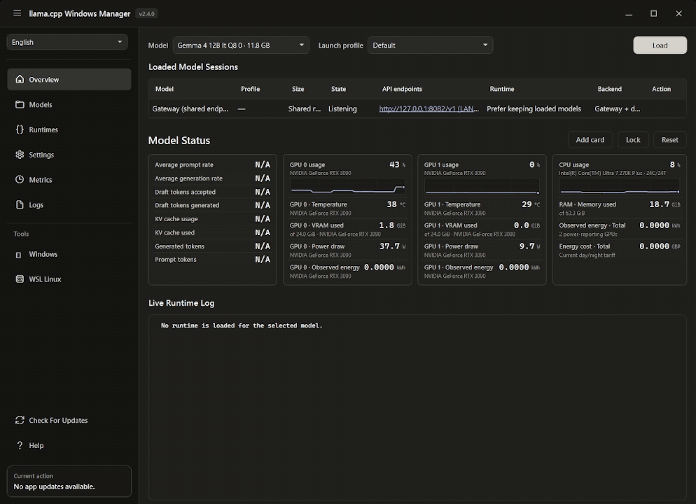

# llama.cpp Windows Manager

A Windows desktop manager for installing `llama.cpp` runtimes, organizing GGUF
models, saving launch profiles, and running supervised OpenAI-compatible model
endpoints on native Windows or Ubuntu/WSL.

> Unofficial community project. Not affiliated with or endorsed by
> `llama.cpp` or `ggml-org`.

[Download the latest release](https://github.com/alekk89/llama-cpp-windows-manager/releases/latest)
· [Read the documentation](docs/DEVELOPMENT.md)
· [Automate with `llwmctl`](docs/CONTROL_API.md)

<p align="center">
  <a href="https://buymeacoffee.com/alekkson">
    
  </a>
</p>



## Why use llama.cpp Windows Manager?

* **Control `llama.cpp` without managing commands and processes by hand.**
* **Run multiple models simultaneously**, each with saved settings, a dedicated
  port, and its own `/v1` endpoint.
* **Choose a runtime for each launch profile:** native Windows or WSL, using CPU,
  CUDA, Vulkan, or Intel Arc SYCL.
* **Connect OpenAI compatible coding and chat clients** through direct model
  endpoints or one shared gateway.
* **Automate and monitor advanced workflows** with model groups, transactional
  loading, idle unloading, live metrics, logs, and the authenticated `llwmctl`
  control API.

> Choose a chat focused tool when simplicity is the priority. Choose llama.cpp
> Windows Manager when you need deeper control, multiple managed models, and
> dependable local endpoints.

## Install

Download the Windows x64 installer or portable ZIP from
[GitHub Releases](https://github.com/alekk89/llama-cpp-windows-manager/releases/latest),
along with its matching `.sha256` file. Releases are self-contained; installing
the .NET runtime separately is not required.

Verify a downloaded artifact before running it:

```powershell
$asset = "LlamaCppWindowsManager-win-x64.zip"
$expected = ((Get-Content "$asset.sha256" -Raw).Trim() -split "\s+")[0]
$actual = (Get-FileHash $asset -Algorithm SHA256).Hash
if ($actual -ne $expected) { throw "Release checksum mismatch" }
```

- **Installer:** integrated installation, Start Menu entry, updater support, and
  an optional Start with Windows task.
- **Portable ZIP:** no installer; writable application data stays in `data`
  beside `LlamaCppWindowsManager.exe`.
- **Requirements:** Windows 10 or 11 x64. GPU runtimes also require compatible
  vendor drivers and, for WSL backends, a working Ubuntu/WSL environment.

Published artifacts are unsigned unless a release explicitly states that its
signature was produced by the protected signing workflow. A checksum verifies
file integrity; it is not a publisher identity guarantee.

## Quick start

1. Open **Runtimes** and install a prebuilt runtime for Windows or WSL. You can
   also place a folder containing `llama-server` or `llama-server.exe` under the
   configured runtimes folder, then scan or register it.
2. Open **Models** to download a GGUF from Hugging Face or register an existing
   model. To add one manually, copy its `.gguf` file anywhere under the
   configured models folder, then choose **Scan Models Folder**.
3. Select a runtime, adjust the launch settings, and save a profile for the
   model.
4. Open **Overview**, select the model/profile, and choose **Load**. The endpoint
   is ready when its state becomes **Loaded**.
5. Point an OpenAI-compatible client at the displayed direct endpoint, or enable
   the shared gateway in **Settings** and use a model ID returned by
   `GET /v1/models`.

Model inference always requires the API key configured in **Settings**. The key
is protected for the current Windows user and passed to `llama-server` through
its environment rather than its command line. Some upstream llama.cpp builds
leave health or model-catalog metadata public; do not treat those discovery
responses as proof that inference is unauthenticated.

## Profiles, groups, and companions

A launch profile records the runtime, port, context, GPU allocation, sampling,
server, multimodal, and speculative-decoding options for one model. One-shot
overrides do not change the saved profile unless explicitly saved.

Groups are assigned to profiles rather than model records. Loading a group
preflights every runtime, port, duplicate-model assignment, and aggregate VRAM
requirement before starting any member. Retention policy controls automatic idle
unloading; it does not schedule inference requests.

Vision, draft, and MTP companion auto-discovery is intentionally limited to the
main model's exact folder. Explicit compatible paths may point elsewhere. See
[Launch settings schema](docs/LAUNCH_SETTINGS_SCHEMA.md) for how curated and
runtime-discovered options are rendered and persisted.

## Control API and `llwmctl`

`llwmctl.exe` is the command-line client for the authenticated, loopback-only
Manager control API (`/api/v1/*`). This API operates the running application and
is separate from the API-key-protected OpenAI-compatible gateway and direct
model-inference endpoints. It does not start unmanaged `llama-server`
processes.

```powershell
llwmctl status
llwmctl capabilities
llwmctl self
llwmctl models list
llwmctl runtimes list
llwmctl profiles list --model <model>
llwmctl load <model> --profile <profile> --wait
llwmctl sessions inspect <session>
llwmctl gateway inspect
llwmctl sessions metrics <session>
llwmctl sessions logs <session>
```

Automation tools should read [AGENTS.md](AGENTS.md) before operating the app.
The full command and HTTP contracts are documented in
[Local control API and `llwmctl`](docs/CONTROL_API.md).

## Security and data

- The Manager control API is loopback-only and independently authenticated.
- Model serving defaults to loopback. Gateway and direct-port LAN exposure are
  separate, explicit settings.
- Security-owned `llama-server` arguments such as host, port, and API key cannot
  be replaced through custom launch parameters.
- Native child processes are attached to a Windows Job Object so they terminate
  if the Manager exits unexpectedly.
- Downloads and updates validate sizes, checksums when supplied, filenames, and
  archive paths before installation.
- Installer repair, update, and normal uninstall preserve application data
  unless data removal is explicitly selected.

Portable data is normally stored in `data` beside the executable. When that
location is not writable, the app uses `%LocalAppData%\llama.cpp Windows Manager`.
Set `LLAMA_CPP_WINDOWS_MANAGER_WORKSPACE` before launch to choose another
workspace.

## Development

Source development requires Windows 10/11 x64, PowerShell 5+, and the .NET 10
SDK selected by `global.json`. Inno Setup 6 is required only for installer
builds.

```powershell
powershell.exe -NoProfile -ExecutionPolicy Bypass -File .\build-app.ps1 -Restore
powershell.exe -NoProfile -ExecutionPolicy Bypass -File .\test-release-gate.ps1
```

Add `-IncludePublish` to validate the portable package and
`-IncludeInstaller` on a machine configured with Inno Setup. Generated `bin`,
`obj`, `TestResults`, `dist`, logs, local workspaces, databases, and model files
are ignored by Git. Use `clean-repo.ps1` to remove generated output.

Create the installer directly with `build-installer.ps1` after configuring
Inno Setup and, for trusted releases, the signing certificate.

Architecture and contribution details are in
[Development guide](docs/DEVELOPMENT.md) and
[Architecture contract](docs/ARCHITECTURE.md).

## Documentation

- [Release readiness](docs/RELEASE_READINESS.md)
- [Windows installer](docs/INSTALLER.md)
- [Signing releases](docs/SIGNING.md)
- [Local control API](docs/CONTROL_API.md)
- [Release hardening audit](docs/AUDIT.md)

## License

Released under the [MIT License](LICENSE). Bundled dependencies retain their own
licenses; see [third-party notices](THIRD-PARTY-NOTICES.md).
