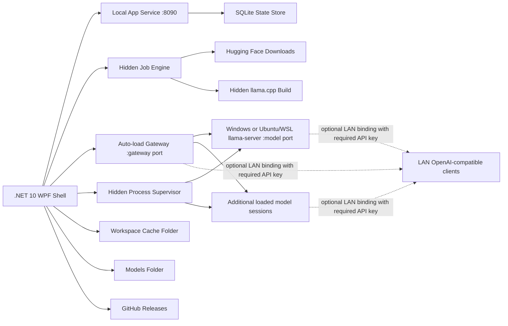

# Target Architecture

Last reviewed: 2026-09-01

## Boundary

The release target is Windows-first and self-contained for the UI, with llama.cpp running either as a native Windows `llama-server.exe` or inside Ubuntu/WSL. The repo owns code and process control:

- .NET 10 WPF desktop shell
- single app instance per Windows user session
- Local app service with per-session auth token
- serialized SQLite state store
- hidden process supervisor for native Windows or Ubuntu/WSL `llama-server`
- local-only model serving by default, with API-key authentication enabled by default and an explicit Local-only opt-out for browser/client testing; scoped LAN exposure for gateway and/or direct model ports always requires a strong key, while upstream health or catalog metadata may remain public
- settings choice rows update immediately, while ordinary text bindings use an idle delay before the shared auto-save debounce so transient typing states are not persisted; focus transitions still commit naturally
- hidden runtime-package/source-build/download jobs
- managed-runtime source identity and local installed-file integrity baselines
- Windows and WSL/Linux environment detectors and setup launchers
- GitHub release update checker with staged portable-exe install
- PowerShell build script only when the user starts a build
- App-owned cache and temporary staging folders

The repo does not own large data by default:

- GGUF models
- downloaded/extracted llama.cpp builds

The startup workspace is fixed for the process and defaults to `data` beside `LlamaCppWindowsManager.exe` when that location is writable. If not, it falls back to `%LocalAppData%\llama.cpp Windows Manager`, while reusing `%LocalAppData%\llama.cpp Console` or `%LocalAppData%\LocalLlmConsole` only when those legacy folders already exist. It can be overridden with `LLAMA_CPP_WINDOWS_MANAGER_WORKSPACE` before launch; `LLAMA_CPP_CONSOLE_WORKSPACE` and `LOCAL_LLM_CONSOLE_WORKSPACE` remain accepted as legacy aliases. Models and runtimes are configured in App Settings and stored in SQLite. Cache data is kept inside the fixed workspace and is not exposed as a separate Settings folder. The source tree contains the platform-neutral Core library, the WPF app, the `llwmctl` control CLI, tests, docs, and the helper script used for llama.cpp builds. Release builds append a bounded ZIP containing the CLI and operator/control sidecars to the app executable and restore verified copies beside it at startup. Keeping that payload outside the managed WPF assembly avoids loading the self-contained CLI with the UI while retaining executable-only recovery. Normal startup compares installed sidecars with the packaged manifest before extracting anything; the explicit bootstrap-only verification mode additionally validates every packaged payload.

Saved startup-profile selections are ordered foreign-key references to named
launch profiles, so deleting a profile or model removes its selection. After
active-session recovery, startup attempts each remaining selection through the
normal keep-loaded gateway/runtime lifecycle before the gateway listener starts.
This preserves readiness checks, port and admission rules, and same-model
multi-profile session identity.

## Runtime Shape

## State And Recovery

Current:

1. SQLite operations are serialized inside `StateStore` so UI timers, downloads, and localhost API reads do not share the connection concurrently.
2. Schema migrations are applied idempotently and recorded in the `migrations` table.
3. Settings saves are transactional.
4. Bad settings rows are backed up under `state\corrupt-settings` and replaced with defaults.
5. Corrupt database files are quarantined under `state\corrupt-database-*` and recreated on startup.
6. Startup keeps the workspace root immutable for the running process.
7. Completed app updates write a pending notice under the workspace cache so the relaunched app can show release notes and then delete the notice.
8. Model-group definitions and launch-profile assignments are replaced in one
   SQLite transaction; a failed constraint or write leaves the previous group
   snapshot intact.
9. Usage writes update the legacy token aggregate and an hourly UTC fact bucket
   in one transaction. The fact stores tokens plus optional active-processing
   time and request counters. Core aggregates facts into local calendar days,
   preserving old totals without inventing historical dates.
10. `LoadedModelSessionManager` serializes lifecycle mutations through one
    re-entrant async gate and publishes detached immutable snapshots under a
    state lock. UI refresh, gateway routing, control requests, readiness, and
    shutdown never enumerate the mutable session dictionary directly.
11. Confirmed shutdown stops supervised runtime sessions before local hosts and
    state teardown. Non-critical stage failures are recorded while remaining
    cleanup continues, and background-task draining is bounded to 15 seconds.
12. Selector favourites are presentation preferences stored separately from
    launch settings for models, profiles, and runtimes. They cascade when their
    target is removed and drive one favorite-first order across page lists,
    selectors, Benchmarks, Metrics, and the tray. Right-click tray snapshots are
    built only when opened; the tray adds no polling loop or background timer.
13. Startup-profile selections are ordered foreign-key references to saved
    launch profiles. Removing a profile or model cascades its startup selection;
    a failure to load one selection does not stop later selections.
14. Main-window bounds plus page-scoped DataGrid column widths/order and
    GridSplitter proportions are stored in `ui_layout_state`. Restoration is
    versioned and monitor-safe, and obsolete control identities are ignored.
15. The default runtime is a singleton foreign-key reference in `default_runtime`.
    Replacing it is atomic; deleting the referenced runtime clears the preference
    through the same transaction's cascade. New profiles read this preference
    without rewriting existing profiles or changing active sessions.
16. Direct model aliases are resolved inside the serialized session start path.
    Effective arguments are kept in session snapshots for recovery and gateway
    forwarding; saved profile arguments are not rewritten. Interactive
    same-model replacement is an explicit launch-preparation choice; automated
    and group loads do not apply that UI preference.

## Architecture Contract

Finished architecture means a feature can be changed through its feature module,
application/workflow boundary, page UI layer, and focused tests without adding
new behavior to `MainWindow` or guessing which service owns a decision.

Dependency direction is intentionally one-way:

1. `LocalLlmConsole.Core` targets plain `net10.0` and owns shared models plus
   portable domain/application policy. It has no WPF, Windows Forms, registry,
   SQLite, or app-localization dependency. The WPF app references Core; Core
   never references the app.
2. Composition roots (`AppServiceFactory*` and `MainWindowServices`) create and
   group services. `AppServiceFactory` is split by lifecycle stage:
   infrastructure services, core shell services, loaded database-backed
   services, catalog helpers, foundation helpers, runtime helpers, and
   model-runtime/gateway helpers. They do not own feature behavior.
3. `MainWindow` is the shell: navigation, app lifetime, foreground/background
   execution wrappers, page hosting, and final UI result application.
4. Page controllers adapt WPF events and page state to application services.
   They may coordinate selection, timers, and reentrancy for a page, but should
   not own domain rules.
5. Page factories build WPF controls only. They should not call domain,
   workflow, storage, process, network, or settings services.
6. Page state classes hold WPF control references and apply simple visual state.
   They should not perform business decisions, IO, or service calls.
7. View models own observable rows, selected items, status/busy text, and
   deterministic row projection. They should not launch processes, touch files,
   or call remote APIs.
8. Application services adapt domain/workflow results to UI-facing actions such
   as busy runners, confirmations, status updates, refreshes, and selection.
   UI callbacks belong at this boundary, not inside domain services.
9. Workflow services own multi-step async flows, jobs, external command
   sequences, and recovery/retry behavior. They return plans/results and stay
   independent of WPF controls.
10. Domain services own pure decisions and feature-specific rules. They should
   return records, plans, rows, or validation outcomes instead of mutating UI.
11. Infrastructure services own OS, filesystem, process, storage, HTTP,
    security, formatting, and dialog primitives. They should not encode feature
    policy beyond their narrow boundary.

The local control surface preserves its small `HttpListener` host but is split
by responsibility: `LocalControlApi.cs` owns admission, audit, routing, status,
and capability discovery. Explicit handlers separate model, profile, group,
runtime, session/gateway/metrics, settings, logs, jobs/Hugging Face, and
operation routes while sharing the narrow request/response infrastructure in
`ControlEndpointHandler`. New endpoint domains belong in a focused handler
rather than a `LocalControlApi` partial or a larger host/router.

Application resources follow the same composition rule. `App.xaml` only merges
the palette, foundation/button, input/menu, and data/surface dictionaries under
`Themes`; controls continue to resolve the same dynamic resource keys so live
theme switching remains behaviorally unchanged.

Managed runtime packages and source builds stamp `local-llm-runtime.json` with
provider/source identity and a SHA-256 manifest of installed files. Runtime
inventory details read that file directly, and re-verification compares current
files with the recorded baseline, including missing and unexpected files. This
is local change detection, not publisher authentication. Manual registrations
have no Manager-recorded baseline and are labelled unverified custom runtimes
rather than being presented as equal to Manager-installed runtimes.

Service naming should describe ownership:

- `*ApplicationService`: UI-facing workflow composition and side-effect
  sequencing through explicit actions.
- `*WorkflowService`: multi-step domain/process/job flow.
- `*Controller`: stateful page/UI coordination, timers, reentrancy, or event
  routing.
- `*Factory`: construction of controls, services, or immutable request objects.
- `*State`: control references or page/session state without business rules.
- Plain `*Service`: focused domain or infrastructure behavior.

Splits and merges should follow responsibility, not aesthetics. Add a new type
when it owns a real decision, state machine, external boundary, dependency set,
or repeated behavior that would otherwise blur a module. Split a file when it
has multiple stable reasons to change or multiple independently testable
policies. Merge or delete pass-through services that only forward calls without
adding policy, validation, state, adaptation, or boundary protection.

Tests should protect behavior first. Source-shape tests are acceptable only for
durable architectural guardrails: dependency direction, module placement,
service composition, and deliberate absence of direct `MainWindow` or WPF
coupling. They should not freeze incidental implementation strings when a
behavior test can express the rule.

Reviewability limits are executable architecture rules: production C# files
receive a review warning above 400 nonblank lines and fail above 500; test C#
files warn above 650 nonblank lines and fail above 800. The code-shape report
excludes generated sources, validates explicit declarative exceptions, lists the
largest files, and also reports aggregate MainWindow growth. `MainWindow*.cs`
retains its separate 300-nonblank-line hard boundary. Splits must name a cohesive
behavioral area; numbered or arbitrary partial files do not satisfy the design
rule. Any exception must be path-specific, classify the content, say whether it
is behavioural, document why it remains cohesive, set its own limits, and name
the condition that will cause a future split.

## Current Service Boundaries

`LocalLlmConsole.Core` owns the complete model contract and reusable portable
behavior: access/package preference normalization, endpoint addressing, launch
argument and option parsing, Hugging Face launch suggestions, runtime package
asset selection, runtime/session decisions, dashboard selection/render policy,
and metric/slot parsing and aggregation. Existing `LocalLlmConsole.Models` and
`LocalLlmConsole.Services` namespaces remain stable across the assembly split.
The architecture test enforces the plain `net10.0` target, the absence of
Windows/WPF/SQLite/localization references, and the one-way App-to-Core project
reference.

The WPF window is intentionally a shell: app lifetime, shell navigation, event
brokerage, and final UI result application stay there. Reusable behavior is
split into feature services, workflow/application services, view models, page
state, and page controllers. `LaunchSettingsPageController` owns launch-form
render/save/reset coordination and `OverviewSelectionController` owns Overview
model/profile/session selection plus endpoint inspection. Their MainWindow
partials are thin delegates. Startup/shutdown wiring stays in
`MainWindow.xaml.cs`; shell fields and loaded-service lifecycle holders stay in
`Ui/Shell/MainWindow/Core/MainWindow.State.cs`; page-specific row/event routing lives behind page
controllers where a page has meaningful action wiring.

`MainWindow` dependencies are grouped by ownership. Core services are read
through named bundles (`App`, `Ui`, `Models`, `Runtime`,
`HuggingFaceServices`, and `Environment`), and loaded services are read through
their post-startup bundles (`App`, `Models`, `Gateway`, and `Runtime`). These
bundle records intentionally do not expose flat pass-through aliases; the
dependency graph should be readable by module.

App-owned service files are grouped by feature instead of living in one flat
folder. The top-level WPF-app `Services` folder is reserved for composition/root wiring
(`AppServiceFactory*` and `MainWindowServices`), while implementation code lives
under `Services/App`, `Services/Environment`, `Services/Gateway`,
`Services/HuggingFace`, `Services/Infrastructure`, `Services/Models`,
and `Services/Runtimes`. Runtime implementations are divided again by stable
responsibility under `Build`, `Catalog`, `Deletion`, `Launch`, `Packages`,
`ProfileFit`, `Readiness`, `Sessions`, and `Telemetry`. `ProfileFit` owns exact-runtime
`llama-fit-params` capability probing and deterministic fit process execution;
portable parsing and OOM classification remain in Core. UI factories and page state are
similarly grouped under `Ui/Common` and `Ui/Pages/*`, while thin window adapters
live under `Ui/Shell/MainWindow/*`; larger UI factories such
as `LaunchSettingsPanelFactory` are split into shell, section composition,
control factories, picker menus, and layout helpers. `ModelGroupDialogFactory`
is likewise split into manager, assignment, editor, and shared-helper partials.
The current code keeps
file-scoped namespaces stable; namespace tightening can happen module-by-module
if it provides clear value.

### Benchmark boundary

Benchmark records, deterministic scope expansion, matrix sizing, logical
command generation, serving-workload expansion, result parsing, and comparison signatures live in
`LocalLlmConsole.Core`. They have no WPF, process, SQLite, or Windows dependency.
The WPF app's `Services/Benchmarking` module owns on-demand capability probes,
native/WSL process construction, a profile-serving HTTP runner, verified cancellation, the exclusive compute
lease, Manager-owned job coordination, workload-safe comparison, and export
formatting. The serving runner snapshots and launches the exact selected profile,
uses the runtime's OpenAI-compatible response timings as the primary speculative
measurement, never persists generated content, and rejects required speculative
variants with no reported draft activity while allowing an explicit `none`
baseline. Type changes clear incompatible saved companion paths before exact-folder
companion or embedded-MTP resolution. Capability probes for low-level mode use each exact runtime's `--help` and
`--list-devices` output. The existing
`JobEngine` stores run/checkpoint payloads; `StateStore.Benchmarks` stores raw
and normalized result rows under the job foreign key.
Environment identities include the upstream build, backend/mode, host operating
environment, CPU/GPU/device identity, and Manager version; workload identities
exclude those dimensions so cross-runtime comparisons remain possible.

The feature is composed as `Lazy<BenchmarkApplicationService>`. Merely starting
the Manager or advertising control routes does not construct it. Opening the
Benchmarks page or calling a benchmark control route activates it. One queue
task and at most one Manager-owned benchmark server or `llama-bench` process exists during a run. The page subscribes
to events only while loaded; the run survives page navigation. No benchmark
poller, hosted worker, dedicated database connection, or idle power request is
permitted.

`BenchmarkProcessRunner` closes its native process job when the benchmark parent
exits, before draining output, so descendants cannot hold inherited pipes open.
Output draining remains cancellable and bounded; cancellation and failure paths
also close the owned job before waiting for readers to finish.

`LoadedModelSessionManager` is the single compute-admission boundary. A
benchmark lease stops explicitly authorized sessions before admission, can start
and stop only sessions owned by that lease, and holds
the lifecycle gate for the run; new session lifecycle operations fail while the
lease is active. Native benchmark children use a kill-on-close Windows Job
Object. WSL children use a unique `exec -a` marker and marker-specific verified
termination. The active queue alone may hold a Windows system-awake request.

- `MainWindowViewModel` and page view models (`OverviewPageViewModel`, `ModelsPageViewModel`, `RuntimesPageViewModel`, `RuntimePackagesPageViewModel`, `RuntimeBuildsPageViewModel`, `RuntimeMetricsViewModel`, `WindowsPageViewModel`, `WslLinuxPageViewModel`, `HuggingFacePageViewModel`, `LogsViewModel`, `SettingsPageViewModel`, `LaunchSettingsViewModel`, `UpdatesPageViewModel`, and `LifetimeMetricsViewModel`) own row collections, selection lists, status/busy state, and deterministic row projection for migrated pages.
- `LocalControlApi`, its explicit endpoint handlers, `LocalControlDiscoveryService`, and `llwmctl` own the versioned loopback automation surface, current-user endpoint/token discovery, safe model self-identification, full typed setting patches, endpoint inspection without secret disclosure, and structured command output. The CLI separates argument parsing, connection discovery/DPAPI handling, output, and help from request construction and self-stop admission. `ControlAppSettingsMutationService` owns control-surface settings normalization, protected-field enforcement, mandatory API-key validation, and live port-conflict checks. `ControlRuntimeOperationApplicationService` owns runtime package/source/build/job dispatch; `ControlNonRuntimeOperationApplicationService` owns cache, logs, lifetime, download, Windows/WSL, and update dispatch. Both compose existing application services without placing those workflows in `MainWindow`. `ControlRequestAdmissionService` applies self-preservation rules, while `ControlOperationCatalog` exposes machine and application operations. `ControlApiAuditLogService` writes a bounded request audit containing only method, path, result status, and duration; `LogFileService` exposes it in the Logs page as Type **Control API**. Control actions reuse the same model/runtime services and dispatch UI synchronization through the shell bridge.
- `StateStore`, `ModelGroupService`, `OverviewModelGroupLoadPlanningService`, `OverviewModelGroupLoadApplicationService`, `JobEngine`, and `SecretProtector` own durable state, transactional launch-profile-group replacement, validated membership/retention policy, group-load planning and rollback, jobs, protected settings, and persisted job-transition validation. A supervised session resolves policy through its stored launch-profile ID, allowing profiles of one model to differ. Legacy model-level assignments migrate to the model's default profile. Group loading validates the complete runtime/port/aggregate-VRAM plan before starting its first member, keeps existing sessions intact, and rolls back only the sessions started by that group action if a target fails. Group eviction priority ranks automatic idle-unload candidates only; it is not an inference scheduler.
- `ModelCatalogService`, `HuggingFaceService`, `HuggingFaceInstallStateService`, `HuggingFaceLaunchSettingsSuggester`, and `ModelCapabilityService` own model discovery, download lifecycle, exact-model-folder companion discovery, embedded NextN/MTP precedence, type-safe MTP/DFlash/DSpark/Eagle3/draft classification, matching mmproj/projector companion downloads, installed/download button state, README launch hints, and local model capability inference. Model and projector transfers run as background workers, and their potentially multi-gigabyte SHA-256 verification uses asynchronous sequential file reads. Hugging Face launch suggestion parsing is split across config JSON parsing, README command extraction, shell tokenization, and option mapping.
- `RuntimeRegistryService`, `LlamaCppLaunchValidator`, `LlamaCppArgumentBuilder`, `RuntimeLaunchOptionSwitchService`, `RuntimeDeletionPlanner`, `RuntimeDeletionExecutorService`, `RuntimePackageSourceCatalog`, `RuntimePackageReleaseClient`, `RuntimePackageAssetSelector`, `RuntimePackageInstallFileService`, `RuntimePackageInventoryPresenter`, `RuntimeBuildCatalogService`, `RuntimeBuildJobService`, `RuntimeBuildToolService`, `RuntimeMetadataService`, `RuntimeEquivalenceService`, `RuntimeFileService`, `RuntimePortAllocator`, `ModelPortAllocator`, and `RuntimeEndpointService` own runtime discovery, launch validation, llama.cpp command projection, advertised positive/negative switch pairing, deletion planning, deletion execution, prebuilt package source/feed selection, release parsing, asset matching, extraction/metadata stamping, package inventory projection, source/build catalog metadata and remote-ref parsing, build job payload/log metadata, build-tool command construction, source/prebuilt equivalence, safe delete boundaries, model-server URLs, stable per-model ports, and served-model matching. The obsolete `RuntimeAdapter` remains only as a temporary source-compatibility facade while downstream callers migrate; production code uses the focused validator and builder directly. Package checksum/extraction, recursive safety inspection/deletion, runtime fingerprinting, and filesystem-backed catalog projection execute away from the WPF dispatcher.
- `LlamaProcessSupervisor`, `NativeRuntimeStopService`, `LlamaRuntimeOutputObserver`, `TrackedProcessRunner`, `WindowsEnvironmentService`, `WindowsSetupCommands`, `WslEnvironmentService`, `WslSetupCommands`, and `CommandLineService` own process supervision, asynchronously awaited native/WSL stop verification, runtime stdout/stderr observation, tracked process execution, Windows and WSL detection/status/tool-probe parsing, setup/probe commands, and visible shell command quoting/launching. Normal unload and restart paths never synchronously wait on a process from the UI dispatcher; the synchronous supervisor fallback is reserved for final disposal after the awaited shutdown path.
- `RuntimeMetrics`, `RuntimeDashboardService`, `RuntimeMtpLogParser`, `RuntimeMetricSummaryTracker`, `RuntimeMetricSummaryCalculations`, `GpuStatusService`, `LogFileService`, `FileSystemSafetyService`, `VramAdmissionService`, and `CacheMaintenanceService` own metrics parsing, live runtime dashboard math, MTP log parsing, per-runtime display state, rate/staleness calculations, CUDA/NVIDIA GPU summaries, Intel SYCL identification, vendor-neutral Windows GPU fallback summaries, log previews/classification/redaction/deletion planning, shared filesystem guardrails, conservative multi-model VRAM admission, and cache clearing safety.
- `UsageMetricsService` owns rolling, complete-current-month, and exact-date
  windows; the rolling 24-month calendar data window; tracking-availability boundaries;
  time-zone-safe daily aggregation,
  cache-hit and throughput calculations, optional request totals, active/peak
  day insights, filters, legacy-total separation, and model breakdowns.
  `LifetimeMetricsApplicationService` coordinates those rules with `StateStore`;
  host GPU energy is stored in combined and per-device hourly buckets. The
  Metrics page renders combined historical energy while per-device history
  remains available to the control API. Device buckets
  begin at first observation rather than inventing a split for older combined data.
  `ElectricityTariffPolicy` validates the app-level ISO-style currency code,
  day/night rates, and local tariff boundary. It derives cost from the immutable
  hourly energy facts, apportions a bucket across minute-level tariff boundaries,
  and is shared by historical reports and in-memory app-live per-GPU totals.
  Changing the tariff therefore recalculates estimates without rewriting energy.
  `UsageDateSelectionService` owns replace, toggle, anchored-range, and additive
  range semantics without a WPF dependency. `LifetimeUsageCalendar` maps input
  modifiers and renders the returned state with WPF drawing primitives, adding
  no charting dependency. Its week-based layout keeps day boxes fixed in size
  and reveals more or less of the latest 24 calendar months with the viewport,
  while the compact range and calendar-metric selectors remain independent from
  storage.
- `AppPreferenceService`, `DisplayFormatService`, `LaunchSettingMetadataService`, `LoadedModelSessionManager`, `RuntimeCatalogApplicationService`, `ActiveRuntimeSessionStore`, `ModelRuntimeStatusTracker`, `ModelRuntimeStatusController`, `ModelRuntimeStatusRenderService`, `AppUpdateService`, `AppUpdateReleaseParser`, `AppUpdateAssetVerifier`, and `BuildAndUpdateDiagnosticsService` own settings option normalization, shared UI value formatting, launch-setting option/help/suggestion text, in-memory loaded-session state and immutable snapshot publication, filesystem-aware runtime/job catalog projection outside view models, running-runtime recovery state, transient model loading/loaded status timing, persisted completed load-duration display, GitHub release updates, release asset selection/version parsing, asynchronous update checksum/extraction work, and build/signature diagnostics. Session starts, stops, replacements, and recovery cleanup pass through one re-entrant lifecycle gate so concurrent UI, gateway, control, and shutdown requests cannot mutate the session set concurrently.
- `HelpCatalogService` owns the compact task-article catalog, section selection,
  localized article projection, deterministic cross-topic search, and result ranking. `HelpPageController`,
  `HelpPageState`, `HelpPageFactory`, and `HelpResultsFactory` own Help search
  interaction, visual state, page composition, expandable result cards, and
  contextual navigation without placing Help behavior in `MainWindow`.
- `TrayProfileMenuApplicationService` projects saved profiles, per-profile tray
  favourites, and immutable session snapshots into start, stop, switch, loading,
  and stopping actions. `TrayProfileMenuController` and
  `TrayProfileMenuFactory` own the lazy, theme-keyed WPF menu, while
  `TrayIconHost` remains the narrow native notification-area adapter. Commands
  reuse the normal model lifecycle application services and do not launch or
  stop processes directly.
- `StartupLaunchProfileApplicationService` projects ordered saved-profile
  selections, persists add/remove actions through `StateStore`, and attempts
  each configured profile through the normal loaded-session lifecycle after
  recovery. `SelectorFavoriteBinding`, `SearchableComboBox`, and the shared
  favorite column/context helpers apply the same persistent favorite state to
  models, profiles, and runtimes without coupling page factories to SQLite.
- `EndpointInspectionService` performs read-only, authenticated live inspection of direct model endpoints (`/health`, `/v1/models`, `/props`, and `/slots`) and the shared gateway (`/health`, `/v1/models`, and `/running`). It preserves partial results when a fork omits an optional endpoint. `EndpointInspectionDialogFactory` renders those normalized results without issuing inference requests and exposes selectable fields plus separate copy actions. `EndpointInspectionReportFormatter` has no API-key input, so the general copied report cannot include the model credential; only the dedicated key action receives it. The complete surface and the Model Groups dialogs use the same 21-pack localization contract as the shell.
- `OverviewDashboardLayoutPolicy` owns the versioned, platform-neutral dashboard
  layout contract, normalization, legacy visibility projection, card ordering,
  metric membership, bounded free-form geometry, version migration, and independent
  per-metric chart selection. `OverviewDashboardController` owns awaited,
  always-active context menus, pointer and keyboard two-dimensional movement,
  content-bounded eight-direction outer-card resizing, metric keyboard
  reordering, responsive coordinate translation, and keyed metric updates;
  `OverviewDashboardMetricRegistry` owns
  the curated metric catalog, semantic value/unit/detail readings, and
  runtime-discovered Prometheus samples. Hardware readings remain atomic: CPU
  load/temperature/current clock, RAM load/used capacity/configured clock, and
  per-GPU load/VRAM/draw power/core clock/core temperature/VRAM temperature can be placed independently
  when their host probes expose values. Curated time-varying readings can be
  charted; configured clocks, capacities, slot counters, and raw samples cannot.
  Hardware plots share a stable host series key rather than the selected runtime
  key, so polling appends history instead of clearing it. Host telemetry refreshes
  through a keyed single-flight cache: CPU/RAM/vendor probes run in parallel and
  slow timer ticks do not overlap. The normal Windows host refresh combines CPU,
  RAM, and Windows GPU identity/performance-counter queries into one PowerShell
  process, while vendor tools remain independent capability adapters. The
  formatted adapter output is parsed once into a typed `HostHardwareSnapshot` at
  the cache boundary; dashboard and energy consumers use that snapshot directly.
  Full hardware snapshots remain fresh for ten
  seconds. The energy sampler reuses a recent full snapshot when it contains
  power sensors; otherwise it runs a power-focused accelerator/identity probe
  that skips the CPU and RAM queries. The Overview always consumes the full host snapshot rather than a
  selected-session-filtered device list. Sampling begins before runtime/model
  selection, and no-runtime transitions clear only runtime
  histories, keeping CPU, RAM, and GPU values and charts live without a loaded
  model. Power-reporting GPUs also register optional app-live energy rows before
  a runtime starts. `ObservedGpuEnergyTracker` accumulates the same per-device
  deltas that are written to historical storage while a model session is active.
  With the default session-only policy, idle power detection backs off to five
  minutes and does not write history; `trackGpuEnergyWhileIdle` restores continuous
  ten-second idle sampling and persistence.
  Its Overview values reset when the Manager process restarts. WPF card and metric-row views render
  those typed presentations without parsing legacy free-form metric lines.
  The curated catalog omits derived per-poll generation, prompt, and speculative
  rates when the runtime only exposes dependable averages; v5 normalization
  removes those stale choices and moves existing charts to average-rate metrics.
  V6 normalization removes static/dead chart choices, while unsupported optional
  sensor rows remain hidden until a finite observation is available.
  V7 normalization migrates the former session-named energy IDs to app-live
  observed-energy IDs without discarding saved cards.
  V8 persists a dashboard-wide card-size lock and the device-independent
  surface width captured when it is enabled. Horizontal positions remain
  responsive, while card widths use that captured sizing reference; the
  placement engine wraps locked cards before applying its single-card viewport
  safety clamp.
  V9 adds an optional bounded title to the generic card contract. Untitled cards
  allocate no header space, and metric rows measure the value/unit column before
  assigning the remaining width to the wrapping label column. V10 introduces a curated catalog and compatibility-safe
  deprecation: cache reuse, draft acceptance, recent counter-delta throughput,
  context high-water/shift counters, selected server-process telemetry, optional
  extended GPU sensors, and gateway observations are atomic rows. Unsupported
  optional rows stay out of the picker; saved legacy rows remain resolvable.
  `GpuPowerObservationParser` and `GpuEnergyAccumulator` convert capability-driven
  host power samples into trapezoid-integrated Wh segments, split them at UTC hour
  boundaries, and reject long gaps or changed sensor sets. `StateStore` persists
  those segments independently from model token usage; the Metrics report rolls
  them into local days and carries observed/detected GPU coverage so partial mixed-
  vendor measurements cannot appear as complete totals. NVIDIA SMI, AMD SMI, and
  Intel XPU-SMI are opportunistic adapters; absent tools or unsupported sensors
  remain unavailable and never produce estimated readings.
  The one-second telemetry poll continues while the window is minimized so
  readiness, counters, and idle-unload policy remain current, while WPF rendering
  is limited to one frame every five seconds and refreshed immediately on restore.
  Runtime output uses a bounded writer that flushes after one second, 64 KiB, or
  session shutdown instead of forcing a disk flush for every line.
  Cards remain headerless by default but may render one optional user title;
  each row still labels itself and owns its optional charts so chart identity
  does not depend on card position. The card context menu manages metric
  membership, charts, and card removal. Windows-style geometric hit-testing maps
  the visible outer border to four side and four corner resize directions without
  adding overlay controls; the border supplies hover feedback and the interior
  remains the move surface. Focusable cards expose the same actions through
  Shift+F10/Menu, Ctrl+Arrow movement, Ctrl+Shift+Arrow resizing, and
  Alt+Up/Down metric reordering. The
  layout engine resolves placement after WPF measures each card's real text and
  chart minimum, snaps nearby cards, and prevents overlap while preserving a
  minimum visual gap. Vertically resized edges align with the corresponding edge
  of an already adjacent card when they enter the snap threshold. Drag and resize interactions begin from those rendered
  outer bounds rather than stale persisted coordinates, then atomically persist
  every resolved card position so collision correction cannot leave overlapping
  coordinates behind. Dashboard-specific
  telemetry styling remains entirely
  theme-keyed: raised surfaces, hairline row separators, tabular measurement
  typography, and framed microplot grids reuse the shell palette in both themes.
  The shell retains the composed Overview surface across normal page navigation,
  while localization changes may explicitly rebuild it. The independent hardware
  sampler continues applying host readings to that retained controller off-page,
  so returning to Overview displays existing cards and current hardware state immediately.
  Other pages retain their view-model rows but release WPF control references when
  navigation leaves the page; their factories already rebuild those views on entry,
  so inactive visual trees do not accumulate without changing navigation behavior.
- `OverviewPageState` applies the persisted dashboard layout plus visibility
  preferences for the model-status, log, and raw-metrics rows, and evaluates the selected
  model/profile action state so Load is suppressed only when the running launch
  profile matches the selected profile; `ModelsPageState` does the same for
  the Hugging Face row. They collapse associated grid space and splitters while
  leaving runtime observation and download services active.
  `SettingsPageDefinitionService` exposes the three independent surface preferences
  for Model Status, Live Runtime Log, and the Models Hugging Face section in the
  compact **UI** category. The raw llama.cpp metrics switch and six legacy
  dashboard metric-group booleans remain persisted and automation-compatible but
  are intentionally omitted from Settings; card content is customized directly
  on Overview.
  `AppSettingsUpdateService` continues to validate compatible Show/Hide values,
  and `StateStore.Settings` explicitly reads and writes each SQLite key plus the
  structured `overviewDashboardLayout`. Cards are generic containers; v2
  introduced atomic metric IDs for CPU, RAM, individual GPUs, runtime counters,
  token rates/totals, KV values, and raw Prometheus series, while v3 persists
  responsive horizontal and pixel-based vertical bounds, v4 persists a set
  of independently enabled metric charts, and v5 retires unreliable live-rate
  rows while preserving their average-rate equivalents. V6 limits charts to
  curated time-varying values and gates optional hardware rows on observed host
  capabilities, v7 migrates observed-energy IDs, and v8 adds the persisted
  dashboard-wide fixed-size mode. V9 adds optional card titles without changing
  metric membership. V10 adds curated metric categories, derived efficiency and
  context readings, process/GPU capability readings, and gateway performance
  observations while retaining legacy-ID rendering. V11 changes the production
  default to unlocked, equal-width runtime-summary and host/energy cards; the
  Overview controller adds GPU cards only for discrete devices and leaves GPU
  core clock out of the default template without removing either metric from
  custom layouts. V12 makes the production-default cards uniformly compact and
  removes GPU power draw from their default charts while preserving it as a live
  value; GPU utilization remains charted. The six compatibility
  booleans project metric-group presence into the canonical layout so existing
  control clients remain compatible. Version 1 composite IDs, v2 packed cards,
  v3 singular-chart layouts, and v4/v5 chart selections migrate without
  discarding valid metric membership, sizing, or charts. A
  debounced `SettingsPageState` change notification persists valid edits and
  reapplies page state without rebuilding the focused editor. Missing keys use
  the documented per-surface defaults. The typed `AppSettings` control schema
  exposes the same fields automatically. UI-scale and text-scale slider values
  are the focused exception: `SettingsPageState` applies each movement
  synchronously through `ApplicationUiScaleService` or
  `ApplicationFontScaleService` and cancels any older pending settings write,
  while the slider's pointer/key release schedules the single persistence commit
  for the latest value.
- `ModelGatewayService`, `ModelGatewayRequestAccessPolicy`, `ModelGatewayRequestResolver`, `ModelGatewayUpstreamProxy`, `ModelGatewayResponseWriter`, `GatewayModelLoadWorkflowService`, `GatewayRuntimeApplicationService`, `GatewayActivityStatusTracker`, `GatewayActivityStatusController`, and `GatewayPerformanceTracker` own the shared auto-load router, access/CORS checks, model-id resolution, upstream proxying, client-facing response payloads, policy-aware load workflow, client-facing load failures, Overview routing status, and bounded request latency/health observations.
The largest service classes are also split by concern: `StateStore` separates catalog, model-group policy, settings, job persistence, and legacy launch-default migration; `HuggingFaceService` separates search, download lifecycle, safety verification, projector companion handling, and launch-profile suggestions; `LlamaProcessSupervisor` separates runtime lifecycle, launch helpers, and WSL cleanup helpers; `RuntimeBuildCatalogService` separates default presets, custom repository persistence, downloaded source metadata, preset row presentation, and backend/mode identity helpers; `RuntimeMetadataService` separates package metadata reads, preset inference, commit helpers, and runtime folder/package path helpers; `ModelGatewayService` delegates access policy, request/model resolution, upstream proxying, and response payloads to gateway helpers; `RuntimeDeletionPlanner` separates direct runtime, package, source-cache, and build-preset planning while `RuntimeDeletionExecutorService` performs state/filesystem mutation; `AppUpdateService` delegates release parsing and checksum verification to update helpers; and `ModelCatalogService` keeps legacy metadata parsing separate from normal scan/import/delete flows.

Domain models are grouped by use instead of living in one catch-all file: core records/enums, app defaults, per-model launch settings, and runtime/download launch payloads each have dedicated model files. MainWindow background refreshes and monitors go through a shared `RunBackground` wrapper so failures are logged and surfaced in the status line instead of becoming unobserved tasks.

`ApplicationThemeService` owns dynamic application resource replacement,
system-theme detection, and Windows high-contrast palette projection.
`ApplicationUiScaleService` owns the persisted application-only scale multiplier,
applies it to the content of every current or newly loaded Manager window, and
preserves WPF's existing Per-Monitor-V2 DPI behavior rather than replacing it.
`ApplicationFontScaleService` separately scales inherited and explicitly sized
WPF text while preserving control dimensions, spacing, and existing layout
transforms.
`UiLayoutPersistenceService` observes the shell's current page and applies one
generic persistence policy to every page `DataGrid` and `GridSplitter`. It
cancels restoration of superseded pages, detaches observers on close, and
debounces column-width, display-order, splitter, and main-window changes into
the versioned `ui_layout_state` SQLite table, restores them as pages are
composed, and clamps obsolete window bounds to the current virtual desktop.
Shared flexible text/action column types coerce page-specific sizing hints to a
compact 48-pixel user minimum while fixed glyph columns retain their explicit
widths and destructive responsive columns retain the 36-pixel **×** minimum.
WPF's paired header grippers keep the shared boundary resizable from either
adjacent column. Responsive action labels preserve their full automation name
and tooltip while displaying a compact glyph.
`SettingsPageResponsiveCoordinator` preserves settings-section order while
switching the page between one and two columns at its content-width breakpoint.
`VisualTreeTraversal` and `UiAccessibility` provide shared WPF traversal,
visible keyboard-focus, and automation helpers. `MainWindow` no longer contains
duplicated page factories, metric factories, theme palettes, or control
operation workflows, and every shell partial is bounded by an architecture test.

## App Update Lifecycle

Current:

1. The Updates navigation item sits below Logs and defaults to **Check For Updates**.
2. Startup checks the configured GitHub release feed in the background. When a newer release is found, the nav item changes to **Install Update**.
3. Manual checks show either a no-updates popup or an install confirmation.
4. Install streams the release asset into `cache\app-updates` through its
   manifest size boundary, extracts portable files when the asset is a zip,
   starts a hidden PowerShell helper, stages and verifies sibling app/CLI files,
   waits for the helper’s acknowledgement before closing the app, atomically
   replaces both with rollback backups, and
   restarts only after the complete replacement succeeds.
5. A matching SHA-256 companion asset is required and verified before extraction.
6. If the installed app is signed, the staged update executable must be signed by the same certificate before replacement.
7. Non-critical staging cleanup is best effort after replacement and cannot
   suppress restart; replacement or verification failures still fail closed.
8. The relaunched app shows the GitHub release name and notes from the installed update.

The protected stable-release workflow signs assets and publishes SHA-256
companions. Local and pull-request artifacts remain unsigned development builds.

## Model Lifecycle

Current:

1. Choose a models folder, scan it on demand, or explicitly select one GGUF file anywhere on disk.
2. Classify readable GGUFs from role metadata first (`MainModel`, `VisionProjector`, `SpeculativeAssistant`, or `Ambiguous`), use narrow filename conventions only as a fallback or conflict signal, and return per-file scan diagnostics instead of silently relying on broad name exclusions.
3. Auto-register main-model GGUFs in SQLite. An explicit file import rejects invalid GGUFs, asks for confirmation before treating a companion or ambiguous file as a main model, and persists that confirmation so later scans do not discard the registration.
4. Pick a prebuilt or custom built llama.cpp runtime and launch settings.
5. Load/restart/unload explicitly; more than one launch profile can stay loaded at the same time, including profiles backed by the same GGUF, when each profile has a unique saved port and hardware capacity allows it.
6. Search Hugging Face from the Models page, paste a Hugging Face repo or GGUF file URL directly, review compatibility signals, open the selected repo's model card, and download/install the selected GGUF plus a discoverable verified mmproj/projector companion as a background job.
7. Delete registration or app-owned model directory according to ownership flags.
8. Generate compact model manifests from readable GGUF metadata while preserving imported/download metadata.
9. Bound downloads by their expected size while streaming, then verify expected
   byte counts or SHA-256 before registering downloaded GGUF files.
   The worker also persists failures from filesystem preparation before transfer
   begins, so a stopped worker cannot silently leave a queued job. If persistence
   itself fails, trace both errors and release the active-download registration.
10. Validate local vision/projector pairing by surfacing missing mmproj files in capability summaries, invalidating cached capabilities when a projector is added or removed, carrying auto-detected, embedded/model-bundled, or explicit per-model Vision head choices, carrying a separate MTP head path for compatible `--mtp-head` runtimes, and carrying per-model dynamic-resolution image token allowances through to `llama-server`.
11. Save named launch variants per model so users can keep multiple runtime/port/context/vision profiles without duplicating model registration.
12. Keep model serving local-only unless Settings explicitly enables LAN exposure. Local-only mode may explicitly disable model API-key authentication, which clears the active key while retaining a protected backup for re-enabling it. LAN exposure can be scoped to the auto-load gateway, direct model ports, or both, and always requires a strong key. These settings affect only model-serving endpoints, not the independently authenticated app-local control API.
13. Show model loading progress in Overview with separate model-name and loading-time rows, and retain the completed load duration after readiness is reached so users can see how long startup took.
14. Treat UI visibility as presentation state only. Collapsing cards, logs, raw
    metrics, or Hugging Face controls must never disable collection, downloads,
    or model serving. Absent keys use the documented per-surface defaults.

Gateway routing:

- `AppSettings.GatewayAutoLoadModels` defaults to true and is independent of listener enablement. When false, discovery filters the fully named catalog to exact running model/profile pairs, and inference requests can only reuse those sessions. Known unloaded routes return `503 model_not_loaded` before the lifecycle controller is invoked, even with Single active policy. Alias suffixes are assigned before filtering. Settings persistence, control patches, and UI auto-apply reconfigure the listener; manual lifecycle actions and retention remain independent.

- The auto-load gateway listens on one OpenAI-compatible `/v1` port and never serves a model process itself. Local-only mode rejects every non-loopback peer address before authentication or routing. On Windows, an existing wildcard URL reservation may be reused for the listener so switching from LAN mode does not strand the gateway behind an HTTP.sys 503; the peer-address check remains the serving security boundary in that case.
- `GET /v1/models` exposes one route for every saved launch profile, including a `context_length` extension containing that profile's configured context size and llama.cpp-compatible `meta` values for the GGUF training context, parameter count, and current file size. Metadata inspection is cached by model-file fingerprint, never inferred from names, and reused across profiles for the same model. `RuntimeModelAliasService` reads the first nonempty `--alias` / `-a` value from saved custom parameters for the advertised route ID. Duplicate aliases receive `:2`, `:3`, etc., with defaults first, then model/profile names and internal IDs as tie breakers. Assignment depends on the saved catalog, not running sessions or edit timestamps. Explicit names and legacy route IDs are reserved before suffix allocation. Without an alias, the default retains the registered model ID; other profiles retain their model/profile-derived IDs, including legacy normalization hashes. These legacy IDs remain accepted when aliases are configured.
- Each requested profile launches on its saved direct runtime port. The gateway resolves the requested route to a model/profile pair, ensures that exact profile session is loaded, then proxies the request to that direct port. Under **Prefer keeping loaded models**, another profile backed by the same GGUF starts as an independent session and both routes remain available. Under **Single active model**, all other direct sessions are stopped before the requested profile starts. Concurrent requests for the same profile share one serialized load, while different profile routes may remain loaded together.
- When an active session has runtime aliases, the gateway rewrites only the request's top-level `model` to an accepted runtime alias before forwarding. This resolves numbered gateway names and legacy IDs without changing saved settings, direct aliases, other request fields, or upstream response streams. The active session's aliases are authoritative even if its saved profile was subsequently edited.
- Upstream response headers, including any load/swap delay, have a bounded wait.
  After headers arrive, the body stream has no fixed request-duration timeout;
  it ends when the upstream completes, the client disconnects, or app shutdown
  cancels the request.
- `Prefer keeping loaded models` leaves existing sessions running and uses conservative VRAM admission before adding another GPU-backed model. `Single active model` unloads other direct sessions before loading the requested model.
- Third-party clients discover current profile routes from `GET /v1/models`; the Manager does not discover or edit client configuration.
- Overview reports the gateway as a router row in Loaded Model Sessions so users can see the shared endpoint, route policy, LAN exposure, and current direct-session count in the same place as loaded models.
- Loaded-session rows expose live endpoint inspection by row double-click and endpoint-link click. Direct reports distinguish endpoint-reported defaults and active slot state; gateway reports do not invent one global context or reasoning configuration because those values belong to the routed model profile.

Still needed:

1. Add richer rollback controls for installed runtime builds.

## llama.cpp Runtime Lifecycle

Current:

1. Install prebuilt llama.cpp runtime packages from Runtime Downloads first. Current presets cover official CUDA Windows/WSL, Vulkan Windows/WSL, ROCm Windows/WSL, Intel Arc SYCL Windows/WSL, and CPU Windows/WSL. Curated third-party presets cover Atomic TurboQuant CUDA Windows/WSL and TheTom TurboQuant CUDA Windows, Vulkan WSL, and CPU WSL when those repositories publish matching checksum-verifiable assets.
2. Scan configured runtime roots and register folders containing `llama-server` or `llama-server.exe`.
3. Select a runtime per model and save a stable per-model host and port next to that runtime in model launch settings; application LAN policy still constrains non-loopback binding.
4. Unregister unused runtimes; runtime file deletion is disabled when a runtime is active or referenced by saved model launch settings.
5. Reconcile source-built and prebuilt runtimes from the same curated provider by runtime fingerprint when their binaries match.
6. Build CPU, CUDA, Vulkan, or SYCL llama.cpp for native Windows or Ubuntu/WSL through the Runtime Downloads row state machine: Check source, Download, then Build. Curated source repositories include upstream llama.cpp, Atomic TurboQuant, `ik_llama.cpp`, and TheTom TurboQuant for the platform/backend combinations their `llama-server` build supports. Source-only and custom repositories share the same table, while jobs remain visible for progress and recovery.
7. Delete downloaded source/build folders only when bounded inside the configured runtimes folder. Builds started from the Runtime Downloads table force cleanup of the downloaded source after success so the row resets to Check; lower-level control operations retain the explicit cleanup setting.
8. Filter downloadable and installed runtime inventories by vendor (AMD/Vulkan/ROCm, Intel/SYCL, NVIDIA/CUDA) and platform (Windows or Linux/WSL), while CPU entries remain in the unfiltered inventory.
9. Cancel active runtime build jobs, retry failed/cancelled/interrupted runtime build jobs, clear finished runtime build job records/logs, and show latest build-log progress in the job summary.
10. Detect installed WSL distros from the WSL Linux page, ignoring Docker-managed WSL distros.
11. Select the Ubuntu distro used for WSL launches/builds.
12. Open visible setup commands for Windows CPU/CUDA/Vulkan/Intel oneAPI tools, WSL install, WSL update, Ubuntu install, Ubuntu CPU build-tool install, Ubuntu CUDA Toolkit install, Ubuntu Vulkan tool install, Ubuntu Intel GPU runtime install, Ubuntu Intel oneAPI install, and Ubuntu package update checks.
13. Install CPU build dependencies inside Ubuntu (`git`, `cmake`, compiler tools, pkg-config, libcurl headers, ccache, Ninja) on request.
14. Treat CUDA as a separate WSL setup action, installing NVIDIA's WSL CUDA Toolkit on request and checking for CUDA Toolkit before starting a CUDA CMake build.
15. Treat Vulkan as a separate setup action, installing the Ubuntu Vulkan packages needed by official llama.cpp builds (`libvulkan-dev`, `glslc`, `spirv-headers`, `vulkan-tools`, `mesa-vulkan-drivers`) and checking `vulkaninfo --summary` before starting a Vulkan CMake build.
16. Treat Intel Arc SYCL as a separate setup action, checking Windows oneAPI tools for native launches/builds and Ubuntu Level Zero/OpenCL runtime plus oneAPI DPC++/MKL/DNNL tools for WSL launches/builds.
17. Detect Windows CPU/CUDA/Vulkan/SYCL build tool presence from the Windows page and WSL CPU/CUDA/Vulkan/SYCL build tool presence from the WSL Linux page.
18. Keep Windows and WSL runtime presets distinct so package downloads, source downloads, update checks, build jobs, retries, and delete-all actions do not mix native and WSL artifacts.
19. Treat `master` and latest-release endpoints as discovery channels rather than
    mutable installed identities. A downloaded source records its resolved Git
    commit; a package records its release tag, published target, selected assets,
    verified asset checksums, and a local installed-file integrity baseline that
    detects changed, missing, and unexpected files without claiming publisher
    authentication. Existing installations remain pinned until the user
    explicitly updates them.
20. Resolve the newest compatible release and asset deterministically from a
    package feed. Do not depend on feed ordering, and never substitute a
    different platform/backend when the newest release omits the requested
    checksum-verifiable asset.

Still needed:

1. Broaden runtime compatibility badges beyond the current build-prerequisite checks.
2. Add richer rollback controls for installed runtime packages/builds.

## Architecture Guardrails

The codebase should continue moving by feature module, not back toward large
files.

- Keep `MainWindow` focused on app lifetime, shell navigation, event brokerage,
  and top-level status.
- Keep raw WPF controls grouped behind page state objects.
- Keep page-specific row/event routing in page controllers or presenters when a
  page gains non-trivial action wiring.
- Keep `MainWindowCoreServices` and `MainWindowLoadedServices` as feature-bundle
  records without flat pass-through aliases.
- Keep representative feature services in their owning service module instead
  of relying on filename search to hide accidental moves.
- Keep service and UI implementation filenames unique across modules so tests,
  reviews, and future moves cannot become ambiguous by filename alone.
- Merge pass-through `ApplicationService`/`WorkflowService` pairs when a wrapper
  does not own a real UI adaptation, decision, state, or boundary.
- Prefer behavior tests and module-boundary guard tests over brittle tests that
  assert exact source text in specific files.
