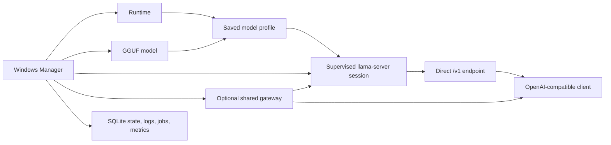

# User guide

llama.cpp Windows Manager is a Windows desktop control plane for local
`llama.cpp`. It manages runtimes, GGUF models, launch profiles, supervised model
servers, OpenAI-compatible endpoints, logs, and telemetry from one application.

For the shortest setup path, see [Getting started](GETTING_STARTED.md). This
guide explains how the application fits together and how to use every page.

## How the application fits together



The main concepts are:

- A **runtime** is a native Windows or Ubuntu/WSL `llama-server` build.
- A **model** is a registered main-model GGUF.
- A **launch profile** combines one model with its runtime, port, context,
  hardware, sampling, and optional companion settings.
- A **session** is a supervised running instance of one launch profile.
- A **direct endpoint** belongs to one loaded session.
- The optional **gateway** provides one stable endpoint and loads or switches
  profiles from the model ID in each request.
- The Manager owns application state, jobs, logs, lifecycle checks, and metrics.
  It does not provide a chat interface of its own.

Application state is stored in a workspace. A writable portable copy normally
uses `data` beside `LlamaCppWindowsManager.exe`; otherwise the default is
`%LocalAppData%\llama.cpp Windows Manager`. Models and runtimes may use folders
configured in Settings. Installer update, repair, and ordinary uninstall keep
application data by default.

## Install and run your first model

Download the installer or portable ZIP from
[GitHub Releases](https://github.com/alekk89/llama-cpp-windows-manager/releases/latest)
and follow [release verification](UPDATES_AND_RELEASE_VERIFICATION.md).

1. In **Runtimes**, install a package matching your platform and backend, or
   register an existing `llama-server` folder.
2. In **Models**, download a GGUF, scan the configured models folder, or choose
   **Add model file…** for a GGUF elsewhere on disk.
3. Select the model and runtime, adjust launch settings, and save a named
   profile.
4. In **Overview**, select the model and profile, then choose **Load**.
5. Wait for **Loaded** and copy the displayed `/v1` endpoint into an
   OpenAI-compatible client.

CUDA targets NVIDIA GPUs, Vulkan commonly serves AMD and other Vulkan-capable
devices, and SYCL targets Intel Arc. A CPU runtime is useful as a compatibility
fallback. WSL runtimes also require a working Ubuntu distribution and the tools
or drivers required by the selected backend.

## Pages

### Overview

Overview is the operational dashboard. Use it to:

- select a model, model group, and saved profile;
- load or replace a profile;
- inspect or unload running sessions;
- open direct endpoint and gateway reports;
- watch model state, hardware, tokens, slots, cache, energy, and runtime logs;
- customize the metric-card layout.

Only one profile for the same physical model can run at a time. Other models can
run concurrently when they use distinct ports and the host has enough capacity.
Selecting a different profile for an already-loaded model replaces that model's
session with the selected profile.

Double-click a loaded-session or gateway row, or select its endpoint link, to
open a read-only endpoint report. **Copy report** excludes the model API key;
only **Copy API key** copies the credential.

Dashboard cards are generic containers. Add or remove metrics, combine unrelated
readings, enable supported charts, add an optional title, and drag or resize the
outer card. **Lock** preserves card dimensions while the window changes size.
Saved layouts are versioned and migrated without discarding unrelated
customization.

Keyboard controls:

- **Shift+F10** or the Menu key opens actions for a focused card.
- **Ctrl+Arrow** moves a focused card.
- **Ctrl+Shift+Arrow** resizes an unlocked card.
- **Alt+Up/Down** reorders a focused metric row.

Optional sensors appear only after the host reports a finite value. Cumulative
counters and raw samples remain useful as values but are not charted when they
do not represent a suitable time-varying series.

### Models

Models owns GGUF inventory and launch profiles. Use it to:

- select the models folder and scan it;
- download from Hugging Face when that section is enabled in Settings;
- register one valid GGUF from any folder with **Add model file…**;
- review metadata, size, missing-file state, and discovered companions;
- configure launch settings and save named profiles;
- create groups and assign profiles;
- unregister or delete models according to ownership.

Scanning reads GGUF role metadata before using narrow filename fallbacks.
Main-model files are registered automatically. Projectors and speculative
assistants are classified as companions. An ambiguous or companion-like file
requires explicit confirmation before it can be treated as a main model;
unreadable or invalid GGUFs are rejected.

Removing a GGUF from disk does not erase its registration or profiles. A later
scan marks it **Missing** so it can be restored or explicitly removed. Deleting
an imported external model removes its registration by default. Deleting an
app-owned downloaded model may remove its managed directory after confirmation.

The launch form includes curated settings and safe options discovered from the
selected runtime's `--help` output. Use Basic mode for ordinary operation and
Advanced mode for runtime-specific controls. See
[Launch settings schema](LAUNCH_SETTINGS_SCHEMA.md) for the rendering,
persistence, and safety rules.

### Runtimes

Runtimes owns installed `llama-server` builds and available packages. Use it to:

- choose the runtime root;
- scan or register existing native Windows and WSL runtimes;
- filter installed and downloadable runtimes by vendor and platform;
- check, download, install, update, verify, or delete managed packages;
- check, download, and build supported source presets;
- add a custom HTTPS source repository.

The normal path is a managed prebuilt package. Source builds are available when
you need a custom branch or configuration. A source row follows **Check →
Download → Build** so a moving branch is resolved before compilation.

The curated list distinguishes providers in every row. Alongside upstream
`llama.cpp`, it includes compatible Atomic TurboQuant, `ik_llama.cpp`, and
TheTom TurboQuant choices. A third-party repository appears as a one-click
package only for platform/backend assets it actually publishes; other supported
combinations remain source-build choices.

Managed package downloads are bounded by expected release size and require
available SHA-256 verification. New installs record a local installed-file hash
baseline. **Verify** detects changed, missing, and unexpected files against that
baseline. **Local integrity checked** is change detection, not publisher
authentication. A manually registered runtime has no Manager-recorded baseline
and is shown as **Unverified custom runtime**.

See [Runtime management](RUNTIME_MANAGEMENT.md) for the trust and lifecycle
contract.

### Benchmarks

Benchmarks defaults to **Saved-profile server benchmark**. This launches each selected saved
profile through the Manager, including its draft model, embedded MTP, MTP head,
or other speculative settings, then sends deterministic non-streaming
OpenAI-compatible workloads to that server. Results include aggregate generation
throughput, prompt throughput when supplied by the runtime, end-to-end latency,
concurrency, draft tokens, accepted draft tokens, and acceptance percentage.
By default a speculative variant is rejected when it produces no observable
draft/MTP activity, preventing a bare-model result from being mislabeled. An
explicit `none` variant is treated as a valid non-speculative baseline.
Each queued profile is an immutable baseline. The profile picker mirrors the
Overview model/profile bar: choose a model, launch profile, and runtime on one
row, then select **Add**. **Profile runtime** uses the runtime saved in that
profile. Every table row is one exact model/profile/runtime selection, so the
same profile can be added again with a different runtime without creating an
unintended cross-product. Remove individual rows with the purple × action or use
**Clear**. The numbered workflow then starts with **1. Launch settings to test**
followed by **2. Choose the request workload**.

For the recommended saved-profile server benchmark, the complete saved launch
configuration is inherited. Only comparison rows enabled on this page—and the
runtime selected for that exact row—replace saved values. Temporary
variants never modify the saved profile. **Keep Windows awake during benchmarks**
and **Stop active sessions after confirmation** are persistent options in
Settings rather than per-plan controls.

Context length, batch and micro-batch sizes, Flash Attention, matched K/V cache
formats, GPU offload, threads, KV offload, multi-GPU mode and split, and
speculative decoding expose compact comparison controls. Multi-GPU mode and
distribution are added as exact pairs. Speculative type and head source are
also added as exact pairs, so the planner never invents a type/head combination
that was not selected. Suggested
context values extend to 256K, batch values to 32K, and
micro-batch values to 8K; these are opt-in candidates rather than guarantees and
still depend on the model, runtime, and available memory. When a control is
empty, every profile uses its own saved value. Selecting a suggested value
activates that comparison automatically and adds a visible removable chip.
Select again to add another value, or type a custom value and press Enter or
**+**. Removing the last chip returns that setting to profile inheritance. The
per-row inheritance and value guidance is available on hover.
K/V cache choices are applied as matching pairs, such as `q8_0/q8_0`, rather
than multiplying every selected K format by every V format. GPU-split
alternatives use semicolons in exported plans because the split itself
is a comma-separated list. A live summary shows the Cartesian combination count per profile while
preserving every other saved setting; the stored profile is never changed. Request batches, concurrency, prompt/generation targets, warm-up, and
delays vary the measured workload rather than the saved launch profile. Each
result records its effective context, batch, runtime, concurrency, and request
count.

Speculative comparisons may include `none`, atomic MTP, draft-model/MTP, and
n-gram modes supported by the Manager. Choose **Profile head** to reuse the
saved compatible draft model or MTP head, or **Automatic** to resolve a
compatible exact-folder companion or embedded `draft-mtp` tensors. Selecting a
different type clears incompatible saved paths. Validation rejects a
variant when its required companion cannot be resolved. These comparisons use
the saved-profile server benchmark; direct `llama-bench` does not run the
speculative serving matrix.

Choose **Direct llama-bench microbenchmark** only for explicit low-level kernel/model measurements. It
runs the `llama-bench` executable shipped beside the selected runtime's
`llama-server` and does not substitute a tool from another runtime. PP, TG,
context depth, and the performance matrix apply to this mode. Its optional
low-level settings remain hidden in normal saved-profile mode. Saved-profile serving
uses explicit PG pairs when present; otherwise it runs the cross-product of the
prompt and generation targets at each requested concurrency.

Choose **Validate** after changing a plan. Validation confirms that model paths
are readable, WSL paths are accessible in the selected distro, serving
concurrency does not exceed the saved profile's parallel slots, speculative
decoding is configured when required, low-level runtimes have a functioning
`llama-bench`, required options are supported, selected devices are reported by
`--list-devices`, and the expanded workload remains within
safety limits. **Run all** becomes available only for a
valid plan and asks for confirmation because benchmarking applies sustained
CPU/GPU load. Active model sessions block a run unless **Stop active sessions
after confirmation** is enabled in Settings and the start warning is confirmed.

The run belongs to the Manager, not the page: navigation does not cancel it.
Pause takes effect after the current runtime/model/profile work item; Cancel
terminates and verifies the active Manager-owned server or native/WSL benchmark
process. Results are stored as
they arrive. Interrupted and failed attempts retain partial rows, while default
completed summaries exclude them. Recent runs are paginated and can be inspected,
resumed, compared by equivalent workload, cloned, exported as CSV or JSON, or
deleted after confirmation. Plans can also be imported and exported as JSON.

The feature is lazy. When no benchmark is active and the page is closed, it has
no benchmark process, worker, timer, page subscription, or system-awake request.

### Settings

Settings controls application-wide behavior rather than one model profile. Its
categories cover:

- storage and cache;
- window and startup behavior;
- model idle unloading;
- runtime source cleanup;
- network exposure, gateway policy, and API-key authentication;
- Overview and Models visibility choices;
- electricity rates and idle GPU-energy tracking;
- log size and Overview runtime-log order;
- theme selection.

Settings save automatically. Choices apply quickly. Ordinary text fields wait
until typing pauses before entering the shared save debounce. Invalid input stays
visible for correction and does not replace the last valid persisted value.

Model-serving API-key authentication is enabled by default and is separate from
the Manager's control credential. Authentication may be disabled only with
**LAN exposure = Local only**. The active serving key is then empty and its
protected backup is restored when authentication is enabled again. Every LAN
mode requires a strong key.

Hiding the Overview model-status section, cards, logs, raw metrics, or the Models
Hugging Face section is presentation-only. The model-status switch collapses the
dashboard section without changing its saved cards; model/profile controls and
the loaded-session table remain visible. None of these choices disable telemetry,
logging, downloads, or model serving.

### Metrics

Metrics presents persisted usage and GPU-energy history. It includes:

- evaluated input, cached input, generated output, and total tokens;
- cache hit rate when the runtime exposes its cache counter;
- prompt and generation throughput based on active processing time;
- request totals when the runtime exposes a compatible counter;
- active days, average per active day, peak day, and model share;
- combined measured GPU-board energy and estimated electricity cost.

Use the model, profile, and runtime filters to narrow token usage. Select **1D**,
**7D**, **30D**, or **All**, or choose exact dates in the calendar.
**Ctrl+click** toggles dates, **Shift+click** selects a continuous range, and
**Ctrl+Shift+click** adds a range. The control API additionally supports current
calendar-month and 90-day ranges.

Accurate daily history begins when daily tracking is first available. Older
lifetime totals are preserved but are not assigned to invented dates. Missing
optional runtime counters are shown as unavailable rather than zero.

GPU energy is measured from supported board-power sensors. By default, history
is persisted while at least one model session is active. Settings can enable
continuous idle tracking. Gaps, unsupported adapters, whole-host power, and app
downtime are never estimated. Electricity cost applies the current day/night
tariff to measured GPU energy; it is an estimate, not a billing ledger.

See [Telemetry and energy](TELEMETRY_AND_ENERGY.md) for precise definitions.

### Logs

Logs collects bounded application, runtime, build, download, update, and Control
API logs. Use it to:

- refresh and preview logs;
- open a selected log or the logs folder;
- delete selected or eligible log files;
- create a diagnostics bundle.

The diagnostics bundle contains bounded, sanitized inventory and recent-event
information. It excludes API keys, control tokens, database contents, model
data, raw commands, and full model/runtime paths. Redaction is defense in depth:
always review every file in the ZIP before sharing it. See
[Diagnostics bundle schema](DIAGNOSTICS_BUNDLE.md).

### Windows

The Windows tool page detects native build prerequisites and relevant GPU tools.
Use it when building runtimes from source or diagnosing a missing native backend.
It can open visible setup flows for CPU build tools, CUDA, Vulkan, and Intel
oneAPI/SYCL. A managed prebuilt runtime normally does not require these build
tools.

### WSL Linux

The WSL Linux page detects `wsl.exe`, installed distributions, the WSL default,
and the Ubuntu distribution selected by the Manager. Docker-managed distributions
are not offered as model-runtime targets.

Use this page to install, update, or remove WSL/Ubuntu components and to manage
Ubuntu CPU build tools, CUDA Toolkit, Vulkan tools, Intel GPU runtime, and Intel
oneAPI. Setup actions may open elevated or interactive PowerShell and report
that installation was **Started**; refresh afterward to verify completion.
Destructive WSL or Ubuntu removal requires explicit confirmation.

### Updates

Updates checks the configured GitHub Releases feed, shows the latest release,
and installs a newer supported build. Startup checks run in the background; the
navigation action changes from **Check For Updates** to **Install Update** when
an update is available.

Stable updates verify the signed manifest, version/channel policy, asset name,
size, SHA-256, and expected Authenticode publisher before replacement. The app
restarts only after replacement succeeds. See
[Updates and release verification](UPDATES_AND_RELEASE_VERIFICATION.md).

### Help

Help contains searchable task-oriented articles for setup, models, runtimes,
networking, authentication, downloads, memory, ports, and troubleshooting.
Choose a category or press **Ctrl+F** to search all topics. Article actions open
the relevant application page. Press **Escape** to clear an active search.

The language selector is in the application sidebar. Production language packs
cover the shell and owned dialogs; preview packs may use clearly identified
English fallbacks for newer Help content.

## Profiles, groups, and companions

A launch profile owns the selected runtime, port, context, GPU allocation,
server behavior, sampling, and optional vision or speculative companions.
One-shot `llwmctl` overrides do not change a saved profile unless explicitly
saved.

Groups contain launch profiles, not model records. A group load validates the
complete set before starting anything: duplicate physical models, missing
runtimes, port conflicts, and aggregate GPU memory can block the operation.
Failure during startup rolls back members already started by that group action.

Retention controls automatic idle unloading:

- **Inherit** uses the global idle timeout.
- **Pinned** prevents automatic idle unloading.
- **Idle timeout** uses the group's own duration.

Priority orders simultaneous automatic idle-eviction candidates. It does not
prioritize inference requests and does not block an explicit lifecycle action or
the gateway's Single active policy.

Vision projectors, draft models, and MTP heads are discovered automatically only
in the main model's exact folder. Explicit compatible paths may be elsewhere.
Use **embedded** vision only with a runtime/model package that supports it. For a
main GGUF with embedded NextN/MTP tensors, `draft-mtp` can operate without a
separate draft-model path.

## Endpoints, gateway, and networking

A direct endpoint serves one loaded profile on that profile's port. The gateway
provides one stable `/v1` address and routes the IDs returned by `GET /v1/models`
to saved profiles. Each route reports its configured `context_length`; `0` means
the profile uses automatic context sizing.

The gateway can prefer keeping loaded models or enforce a Single active model.
Concurrent requests for one active profile remain concurrent. A request for a
different profile of the same GGUF waits for active responses before switching.
Long streamed response bodies are not cut off by the bounded upstream-header
wait.

Model-serving exposure can remain local or allow the gateway, direct endpoints,
or both on the LAN. LAN access also depends on Windows Firewall and, for WSL,
the host networking configuration. The authenticated Manager control API always
remains loopback-only. See [Gateway and networking](GATEWAY_AND_NETWORKING.md).

## Accessibility and display

The app supports keyboard navigation, visible focus indicators, automation names
for interactive controls, status announcements, right-to-left layout for Arabic
and Persian, and live Windows high-contrast palette changes. At narrow supported
window widths, the Models page uses horizontal scrolling rather than clipping
its launch form or actions.

If a control is difficult to reach, collapse the navigation sidebar to give the
current page more space. Use Windows display scaling normally; the initial window
is constrained to the available monitor work area.

## Automation

`llwmctl.exe` controls the running Manager through its authenticated loopback API
and updates the same state shown in the UI:

```powershell
llwmctl status
llwmctl capabilities
llwmctl operations list
llwmctl self
llwmctl models list
llwmctl runtimes list
llwmctl load <model> --profile <profile> --wait
llwmctl sessions inspect <session>
llwmctl metrics usage --range month
```

Automation must use `llwmctl`; do not edit SQLite state, launch `llama-server`
directly, expose the control API, or automate WPF controls. Read
[AGENTS.md](../AGENTS.md) and the complete
[`llwmctl`/Control API reference](CONTROL_API.md) before consequential work.

## Troubleshooting

1. Search the in-app **Help** page.
2. Record the application version and any stable `LLWM-*` error code.
3. Inspect the relevant session, gateway, job, and runtime log.
4. Confirm the selected runtime still exists and the profile port is free.
5. Use a CPU runtime to separate model problems from a GPU backend or driver.
6. For a `401`, verify the model API key—not the separate Manager control token.
7. Create and review a diagnostics bundle before reporting a repeatable failure.

For additional diagnosis, see [Troubleshooting](TROUBLESHOOTING.md) and
[Support](../SUPPORT.md). Never publish API keys, Manager control tokens, private
URLs, or unreviewed logs. Report suspected vulnerabilities through the private
process in [SECURITY.md](../SECURITY.md).
